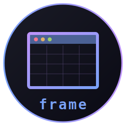
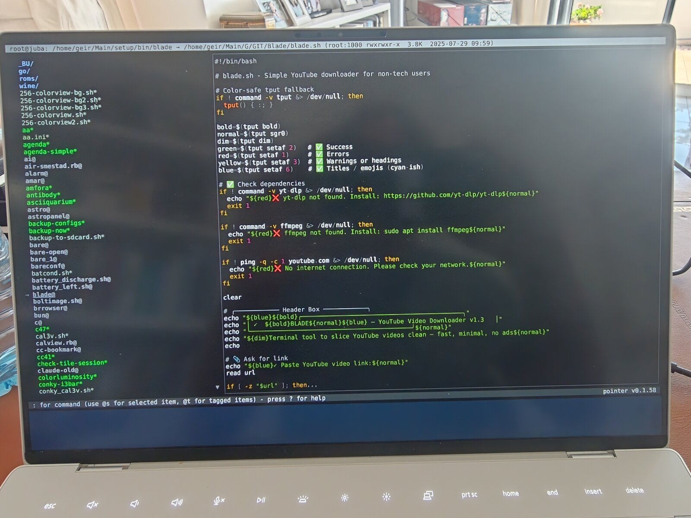

# frame - Pure Assembly X11 Display Server




X11 display server written in x86_64 Linux assembly. No libc, no
toolkits, no FreeType, no Mesa, no Xlib. Just NASM source, direct
syscalls, the X11 wire protocol on a Unix socket, and the kernel's
DRM/KMS + evdev interfaces.

Long-range goal: serve enough of the X11 wire protocol (core + SHAPE +
RENDER + XKB + COMPOSITE + DAMAGE + RANDR + MIT-SHM + XInput2) to host
the whole [CHasm](https://github.com/isene/chasm) desktop plus
arbitrary X clients — Firefox, VS Code, GIMP, Inkscape — all
software-rendered, all on a stack written end-to-end in asm.

<br clear="left"/>



*The whole stack, end to end in assembly: [pointer](https://github.com/isene/pointer)
(a Rust TUI file manager) running inside [glass](https://github.com/isene/glass)
(the asm terminal) on **frame** (the asm X server), shown on the laptop's
panel via DRM/KMS — two-pane layout, syntax-highlighted preview, colour,
keyboard-driven. No libc, no Xlib, no Mesa anywhere in the path.*

## Status: phase 4 of 14 (core protocol + compositor + drawing)

| # | Phase | Status |
|---|-------|--------|
| 1 | Connection setup + Unix socket bind | ✓ shipped |
| 2 | DRM/KMS probe (read-only ioctls, no master) | ✓ shipped |
| 2b | DRM/KMS modeset (CreateDumb + AddFB + SetCRTC) | ✓ shipped |
| 3 | evdev input + KeyPress / Motion routing | ✓ shipped |
| 4a | Multi-client serve loop + dispatch + 16 opcode handlers | ✓ shipped |
| 4b | Window tree + CreateWindow / MapWindow / ConfigureWindow | ✓ shipped |
| 4c | Properties — ChangeProperty / GetProperty / GetAtomName | ✓ shipped |
| 4d.1 | Input API — GrabKey / GrabKeyboard / real US keysym table | ✓ shipped |
| 4d.2 | evdev → KeyPress event delivery | ✓ shipped |
| 4e | SubstructureRedirect routing + ReparentWindow | ✓ shipped |
| 4f | Software compositor — solid-colour rects on the panel via `--display` | ✓ shipped |
| 4g | GCs + window backing store + PolyFillRectangle / PutImage | ✓ shipped |
| 4h | Pixmaps + CopyArea / ClearArea / PolyRectangle | ✓ shipped |
| 5 | Atoms + GetProperty / ChangeProperty / selections | |
| 6 | SHAPE extension | |
| 7 | GCs + drawing primitives | |
| 8 | DRM/KMS atomic modeset upgrade | |
| 9 | RENDER subset for glass emoji + ARGB | |
| 10 | Cursor sprite + keyboard layout + clipboard | |
| 11 | XKB (Firefox-compatible) | |
| 12 | DAMAGE + COMPOSITE + FIXES | |
| 13 | RANDR + MIT-SHM + XInput2 | |
| 14 | First Firefox launch | |

Phase 4 is the "tile runs on frame" milestone — self-hosting CHasm.
Phase 14 is the "Firefox runs on a 50k-line asm X server" milestone.

## Phase 1: what works

```bash
make
./frame                 # listens on display :7 (configurable: ./frame N)
DISPLAY=:7 xdpyinfo     # connects, gets setup reply, sends QueryExtension
```

`frame` accepts an X11 client, validates its 12-byte connection-setup
request (byte-order `l`, protocol 11.0, drains any auth tail), and
emits a structurally valid setup reply describing:

- One screen, 1920×1080, root window XID `0x80`
- Two depths: 24 (TrueColor RGB) and 32 (TrueColor ARGB for glass
  transparency)
- One pixmap format (depth 24 in 32 bpp)

Subsequent requests are logged to stderr (`req opcode=N len=M`) and
silently dropped. Real dispatch lands in phase 4 once the wire is
proven and the DRM backend is in.

## Phase 2: DRM/KMS probe

```bash
./frame --probe
```

Opens `/dev/dri/cardN`, enumerates resources, lists connectors:

```
frame: opened /dev/dri/card1, driver i915 v1.6.0
frame: resources: 4 CRTCs, 5 connectors, 21 encoders
frame: framebuffer range 0x0 to 16384x16384
  connector 507: eDP-1 → connected, 1 modes, preferred 1920x1200 @ 120 Hz
  connector 516: DisplayPort-1 → disconnected, 0 modes
  ...
```

Uses three read-only ioctls — `DRM_IOCTL_VERSION`,
`DRM_IOCTL_MODE_GETRESOURCES`, `DRM_IOCTL_MODE_GETCONNECTOR`. None
require DRM master, so this runs safely alongside an active Xorg.

## Phase 2b: DRM/KMS modeset

```bash
sudo ./frame --modeset
```

Pure-asm path: takes DRM master, picks the first connected
connector, queries its preferred mode, allocates a dumb buffer
(`DRM_IOCTL_MODE_CREATE_DUMB`), mmap's it (`DRM_IOCTL_MODE_MAP_DUMB`
+ `mmap`), fills it solid purple, binds it as a framebuffer
(`DRM_IOCTL_MODE_ADDFB`), and points the CRTC at it
(`DRM_IOCTL_MODE_SETCRTC`). Holds the picture for 5 seconds, then
restores the CRTC's prior state and frees everything in reverse.

### Test recipe

Needs DRM master, which Xorg holds while it's running. From a TTY,
after stopping the display manager:

```bash
# 1. Switch to a TTY
Ctrl+Alt+F2

# 2. Login as geir, navigate to the repo
cd ~/Main/G/GIT-isene/frame

# 3. Stop X (whichever applies — pick one)
sudo systemctl stop sddm           # if KDE plasma
sudo systemctl stop gdm            # if GNOME
sudo systemctl stop lightdm        # if XFCE/MATE
# or, if X was started manually from this TTY, just kill it

# 4. Run the modeset
sudo ./frame --modeset

# 5. Wait ~5 seconds, screen turns solid purple, then restores

# 6. Restart your session
sudo systemctl start sddm      # or however you start
```

Expected stderr:

```
frame: opened /dev/dri/card1
frame: SET_MASTER OK
frame: resources: 4 CRTCs, 5 connectors, 21 encoders
frame: framebuffer range 0x0 to 16384x16384
frame: using connector 507 on CRTC 79, mode 1920x1200
frame: created dumb buffer, 9216000 bytes
frame: filled with purple
frame: added framebuffer 84
frame: SETCRTC OK — displaying for 5 seconds
frame: restored original CRTC, cleanup done
```

The seconds in between are the proof: a CHasm asm binary putting
pixels on the physical panel through nothing but raw DRM ioctls. No
libdrm, no Mesa, no display server — just frame talking directly to
the kernel through the same ABI Xorg uses.

### Safety

The full cleanup path always runs (RMFB → munmap → DESTROY_DUMB →
DROP_MASTER → close), and the CRTC is restored to its prior state.
Worst case if something goes wrong: the screen stays purple until
the kernel reprograms it (the next X start does this).

## Phase 3: evdev input

```bash
./frame --probe-input                       # enumerate /dev/input/event*
./frame --watch-input /dev/input/event3     # live decode events
```

`--probe-input` scans `/dev/input/event0..31`, opens each one read-only,
calls `EVIOCGNAME` (=`_IOC(_IOC_READ, 'E', 0x06, 64)`), and lists what
came back:

```
frame: input devices:
  event0: Power Button
  event1: Lid Switch
  event3: AT Translated Set 2 keyboard
  event5: SynPS/2 Synaptics TouchPad
  event7: SHK Bluetooth (Touch)
  ...
```

`--watch-input PATH` opens the named device and decodes each
`input_event` record (24 bytes: `tv_sec`, `tv_usec`, `type`, `code`,
`value`). Output line format is one of:

```
KEY 30 press        # keyboard: 'A' down
KEY 30 release      # 'A' up
BTN 272 press       # mouse: BTN_LEFT down
REL 0 value=-3      # mouse moved 3 left
REL 1 value=2       # mouse moved 2 down
ABS 0 value=512     # touchpad position
SW  0 value=1       # switch (lid open/close, etc.)
```

Keycodes match `/usr/include/linux/input-event-codes.h`. Phase 4
layers the evdev→XKB→keysym translation on top so X clients see
real keysyms.

### Access

`/dev/input/event*` is `crw-rw---- root:input` on most distros. Either
`sudo`, or `sudo usermod -aG input geir && reboot`. From a VT (where
phase 2b runs anyway) this is automatic if you use `sudo`.

### Config (`~/.framerc`)

frame reads an optional `~/.framerc` (line-based `key = value`, the CHasm
rc convention):

```
keymap = no                # keyboard layout: us (default) or no (Norwegian)
sensitivity = 75           # pointer speed, percent of raw (default 100)
cursor_color = ffffff      # cursor fill colour, RRGGBB hex (default ffffff)
cursor_transparency = 50   # cursor % transparent: 0 solid .. 100 invisible (default 50)
```

`keymap`: `us` (the default, or no file) is the standard US layout. `no`
is Norwegian: `Shift+6` = `&`, the `ø æ å` keys, `< >` on the ISO key left
of `Z`, Norwegian punctuation, and **AltGr** (right Alt = ISO_Level3_Shift
= Mod5) for `@ £ $ { } [ ] \ € ~`. Delivered to clients via
`GetKeyboardMapping` (6 keysyms/keycode, AltGr at level 3), so any X
client (glass, xterm, …) picks it up.

`sensitivity`: scales pointer motion (touchpad + mouse) by this percent.
`100` is raw 1:1; lower values slow the cursor for finer control.

`cursor_color` / `cursor_transparency`: the arrow's interior fill and how
see-through it is. The black outline is always kept for contrast. Colour
is `RRGGBB` hex; transparency `0` is solid, `100` fully invisible. Free
alpha — the DRM cursor plane blends it in hardware.

## How it's built

Pure NASM, no libc, single static ELF. Following CHasm conventions:

```bash
nasm -f elf64 frame.asm -o frame.o && ld frame.o -o frame
```

State is BSS-allocated (no malloc). Per-client connection state lives
in fixed slots; multi-client work in phase 4.

## License

[Unlicense](https://unlicense.org/) - public domain.

## Credits

Created by Geir Isene (https://isene.org) with pair-programming via
Claude Code.
